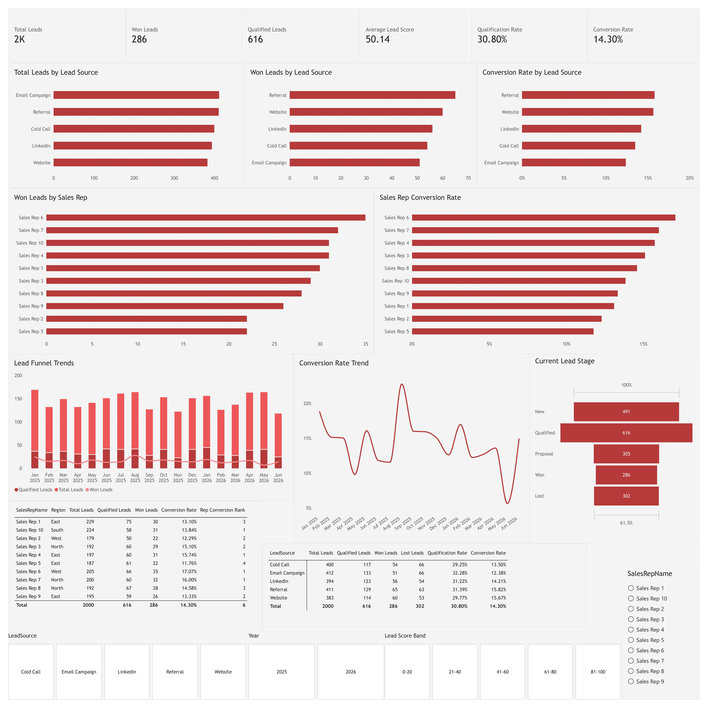

# Lead Conversion Funnel Analysis | Power BI


## 📊 Project Overview

This project is an interactive **CRM Lead Conversion Funnel Dashboard** built using Microsoft Power BI.

The dashboard analyzes lead volume, qualification, conversion performance, lead sources, sales representative performance, and trends over time to identify where leads are performing well and where conversion opportunities exist.

The project uses a structured CRM dataset containing lead, account, sales representative, activity, deal, forecast, and calendar information.

---

## 🎯 Business Objective

The primary objective of this dashboard is to answer key business questions such as:

- How many leads are entering the CRM?
- How many leads become qualified?
- How many leads are ultimately won?
- Which lead sources generate the best results?
- Which sales representatives have the highest conversion rates?
- How does lead performance change over time?
- Where are the biggest differences between lead sources and sales representatives?
- What is the current distribution of leads across CRM stages?

---

## 📌 Key KPIs

| KPI | Value |
|---|---:|
| Total Leads | 2,000 |
| Qualified Leads | 616 |
| Won Leads | 286 |
| Qualification Rate | 30.80% |
| Conversion Rate | 14.30% |
| Average Lead Score | 50.14 |

---

## 📈 Dashboard Features

### 1. Lead Source Analysis

The dashboard compares lead sources based on:

- Total Leads
- Won Leads
- Conversion Rate

This helps identify which acquisition channels are generating the strongest results.

### 2. Sales Representative Performance

Sales representatives are compared using:

- Total Leads
- Qualified Leads
- Won Leads
- Conversion Rate
- Conversion Rank
- Region

This allows management to identify high-performing representatives and potential performance gaps.

### 3. Lead Funnel Trends

Monthly trends track:

- Total Leads
- Qualified Leads
- Won Leads

This provides visibility into how lead activity and conversion performance changes over time.

### 4. Conversion Rate Trend

The dashboard tracks monthly conversion rates to identify changes in overall lead-to-win performance.

### 5. Current Lead Stage

The dashboard shows the current distribution of leads across:

- New
- Qualified
- Proposal
- Won
- Lost

> **Note:** This represents the current stage distribution of leads rather than a historical sequential funnel.

### 6. Interactive Filters

Users can filter the dashboard by:

- Year
- Lead Source
- Lead Score Band
- Sales Representative

---

## 🧮 Key DAX Measures

### Total Leads

```DAX
Total Leads =
DISTINCTCOUNT(Fact_Leads[LeadID])
```

### Qualified Leads

```DAX
Qualified Leads =
CALCULATE(
    [Total Leads],
    Fact_Leads[CurrentStage] = "Qualified"
)
```

### Won Leads

```DAX
Won Leads =
CALCULATE(
    [Total Leads],
    Fact_Leads[CurrentStage] = "Won"
)
```

### Conversion Rate

```DAX
Conversion Rate =
DIVIDE(
    [Won Leads],
    [Total Leads]
)
```

### Qualification Rate

```DAX
Qualification Rate =
DIVIDE(
    [Qualified Leads],
    [Total Leads]
)
```

---

## 🗂️ Data Model

The project uses a dimensional CRM data model consisting of:

### Dimension Tables

- `Dim_Calendar`
- `Dim_SalesReps`
- `Dim_Accounts`

### Fact Tables

- `Fact_Leads`
- `Fact_Deals`
- `Fact_Activities`
- `Fact_Forecast`

### Supporting Table

- `Funnel Stages`

The model uses relationships between dimension and fact tables to allow filtering and analysis across different parts of the CRM dataset.

---

## 🛠️ Tools & Technologies

- Microsoft Power BI
- Power Query
- DAX
- Microsoft Excel
- Data Modeling
- Business Intelligence
- CRM Analytics

---

## 📊 Dashboard Preview

### Detailed Dashboard



---

## 💡 Key Insights

The dashboard can be used to identify:

- Lead sources generating the highest number of leads.
- Lead sources producing the strongest conversion rates.
- Sales representatives with stronger conversion performance.
- Changes in lead volume and conversion over time.
- The proportion of leads currently sitting at different CRM stages.
- Potential areas where lead qualification or conversion can be improved.

---

## 📁 Repository Structure

```text
lead-conversion-funnel-powerbi/
│
├── README.md
│
├── PowerBI/
│   └── Lead_Conversion_Funnel.pbix
│
├── Screenshots/
│   ├── dashboard-overview.png
│   └── dashboard-detailed.png
│
└── Data/
    └── README.md
```

---

## 📦 Dataset

The project uses a structured CRM dataset containing information about:

- Leads
- Accounts
- Sales Representatives
- Deals
- Activities
- Forecasts
- Calendar dates

The dataset used for this portfolio project is **synthetic CRM data** created for analytical and demonstration purposes.

The raw dataset is not included in this repository.

---

## 🚀 Project Purpose

This project was created as a **Business Intelligence / Data Analytics portfolio project** to demonstrate practical skills in:

- Data cleaning
- Data modeling
- KPI development
- DAX
- Interactive dashboard design
- CRM analytics
- Sales performance analysis
- Business-focused data visualization

---

## 👩‍💻 Author

**Akshat Tiwari**

Business & Data Analytics

### Skills Demonstrated

**Power BI · Excel · Power Query · DAX · Data Analysis · Business Intelligence · CRM Analytics· AI**
